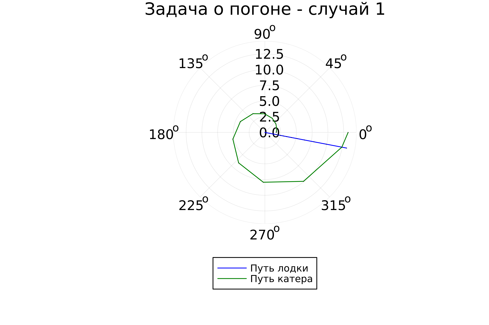
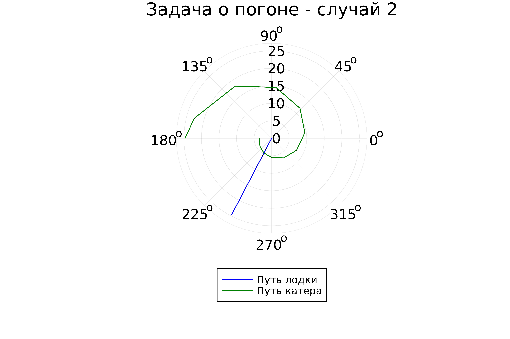

---
## Front matter
lang: ru-RU
title: Лабораторная работа №2
subtitle: Простейший шаблон
author:
  - Легиньких Г.А.
institute:
  - Российский университет дружбы народов, Москва, Россия

## i18n babel
babel-lang: russian
babel-otherlangs: english

## Formatting pdf
toc: false
toc-title: Содержание
slide_level: 2
aspectratio: 169
section-titles: true
theme: metropolis
header-includes:
 - \metroset{progressbar=frametitle,sectionpage=progressbar,numbering=fraction}
 - '\makeatletter'
 - '\beamer@ignorenonframefalse'
 - '\makeatother'
---

# Информация

## Докладчик

:::::::::::::: {.columns align=center}
::: {.column width="70%"}

  * Легиньких Галина Андреевна
  * НФИбд-02-21
  * Российский университет дружбы народов
  * [1032216447@pfur.ru](mailto:1032216447@pfur.ru)
  * <https://github.com/galeginkikh>

:::
::: {.column width="30%"}

:::
::::::::::::::

# Задача о погоне

## Цель работы

Изучить основы языков программирования Julia и OpenModelica. Освоить библиотеки этих языков, которые используются для построения графиков и решения дифференциальных уравнений. Решить задачу о погоне.

# Теоретическое введение

## Julia

**Julia** — высокоуровневый высокопроизводительный свободный язык программирования с динамической типизацией, созданный для математических вычислений. Эффективен также и для написания программ общего назначения. Синтаксис языка схож с синтаксисом других математических языков (например, MATLAB и Octave), однако имеет некоторые существенные отличия. Julia написан на Си, C++ и Scheme. Имеет встроенную поддержку многопоточности и распределённых вычислений, реализованные в том числе в стандартных конструкциях.

## OpenModelica

**OpenModelica** — свободное открытое программное обеспечение для моделирования, симуляции, оптимизации и анализа сложных динамических систем. Основано на языке Modelica. Активно развивается Open Source Modelica Consortium, некоммерческой неправительственной организацией. Open Source Modelica Consortium является совместным проектом RISE SICS East AB и Линчёпингского университета. По своим возможностям приближается к таким вычислительным средам как Matlab Simulink, Scilab xCos, имея при этом значительно более удобное представление системы уравнений исследуемого блока.

## Задание

Задания лабораторной работы разделены по вариантам. 
**Мой вариант 18**

##

На море в тумане катер береговой охраны преследует лодку браконьеров. Через определенный промежуток времени туман рассеивается, и лодка обнаруживается на расстоянии 7,7 км от катера. Затем лодка снова скрывается в тумане и уходит прямолинейно в неизвестном направлении. Известно, что скорость катера в 3,3 раза больше скорости браконьерской лодки. 
1. Запишите уравнение, описывающее движение катера, с начальными условиями для двух случаев (в зависимости от расположения катера относительно лодки в начальный момент времени). 
2. Постройте траекторию движения катера и лодки для двух случаев.
3. Найдите точку пересечения траектории катера и лодки

# Выполнение работы

##

Все расчеты и формулы приведены в отчете

# Код на Julia

##

Установила Julia: (рис. [-@fig:001])

{ #fig:001 width=70% }

##

Установим нужные библиотеки, проверим их установку:

    import Pkg
    Pkg.add("Plots")
    Using Plots
    Pkg.add("DifferentialEquations")
    using DifferentialEquations

## 

Код приведен в отчете

##

Скомпилируем файл командной в PShell: (рис. [-@fig:002])

{ #fig:002 width=70% }

##

Результат для первого случая: (рис. [-@fig:003])

{ #fig:003 width=70% }

##

Результат для второго случая: (рис. [-@fig:004])

{ #fig:004 width=70% }

# OpenModelica

##

К сожалению, OpenModelica не адаптирована к использованию полярных координат, поэтому адекватное отображение результатов данный задачи там невозможно. 

## Вывод

Были изучены основы языков программирования Julia и OpenModelica. Освоены библиотеки этих языков, которые используются для построения графиков и решения дифференциальных уравнений. Поскольку OpenModelica не работает с полярными координатами, она пока что не была использована в данной лабораторной работе.

