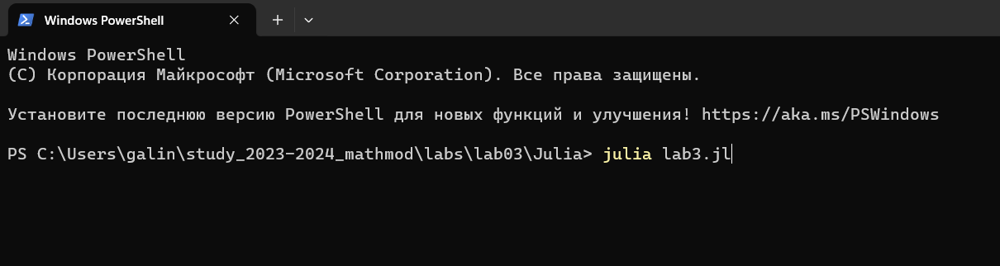
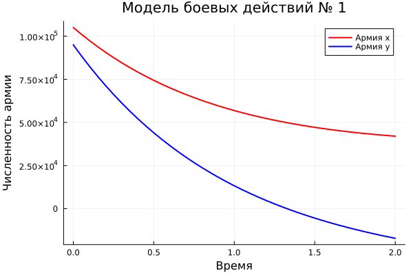
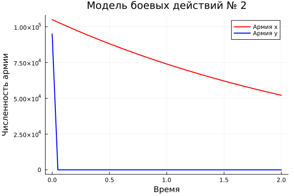
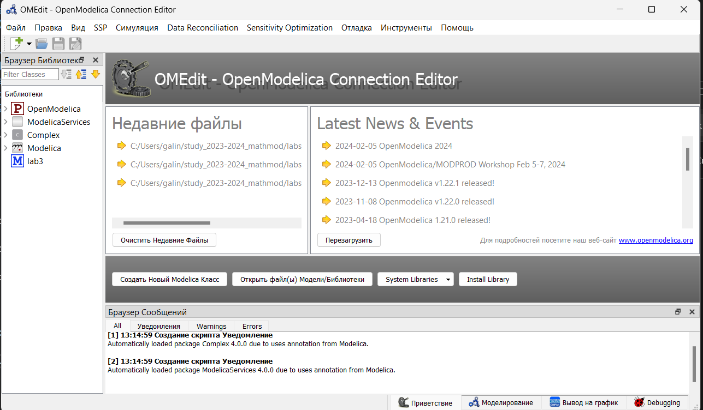
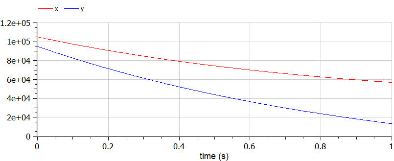
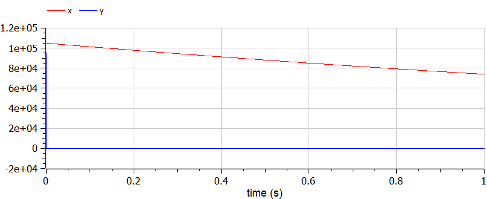

---
## Front matter
lang: ru-RU
title: Лабораторная работа №3
subtitle: Модель боевых действий
author:
  - Легиньких Г.А.
institute:
  - Российский университет дружбы народов, Москва, Россия

## i18n babel
babel-lang: russian
babel-otherlangs: english

## Formatting pdf
toc: false
toc-title: Содержание
slide_level: 2
aspectratio: 169
section-titles: true
theme: metropolis
header-includes:
 - \metroset{progressbar=frametitle,sectionpage=progressbar,numbering=fraction}
 - '\makeatletter'
 - '\beamer@ignorenonframefalse'
 - '\makeatother'
---

# Информация

## Докладчик

:::::::::::::: {.columns align=center}
::: {.column width="70%"}

  * Легиньких Галина Андреевна
  * НФИбд-02-21
  * Российский университет дружбы народов
  * [1032216447@pfur.ru](mailto:1032216447@pfur.ru)
  * <https://github.com/galeginkikh>

:::
::: {.column width="30%"}

:::
::::::::::::::

# Модель боевых действий

## Цель работы

Рассмотреть некоторые простейшие модели боевых действий – модели Ланчестера. Применить их на практике для решения задания лабораторной работы. 

## Теоретическое введение

##

Законы Ланчестера представляют собой математические формулы для расчета относительной численности вооруженных сил. Уравнения Ланчестера - это дифференциальные уравнения, описывающие зависимость численности двух армий A и B от времени, причем функция зависит только от A и B.

В противоборстве могут принимать участие как регулярные войска, так и партизанские отряды. В общем случае главной характеристикой соперников являются численности сторон. Если в какой-то момент времени одна из численностей обращается в нуль, то данная сторона считается проигравшей (при условии, что численность другой стороны в данный момент положительна).

##

Рассмотривается три случая ведения боевых действий:
1. Боевые действия между регулярными войсками
2. Боевые действия с участием регулярных войск и партизанских отрядов
3. Боевые действия между партизанскими отрядами

## Задание

Между страной $Х$ и страной $Y$ идет война. Численность состава войск исчисляется от начала войны, и являются временными функциями $x(t)$ и $y(t)$. В начальный момент времени страна $Х$ имеет армию численностью $105 000$ человек, а в распоряжении страны $Y$ армия численностью в $95 000$ человек. Для упрощения модели считаем, что коэффициенты $a$, $b$, $c$, $h$ постоянны. Также считаем $P(t)$ и $Q(t)$ непрерывными функциями. 

##

Постройте графики изменения численности войск армии Х и армии У для следующих случаев на языках Julia и OpenModelica:
1. Модель боевых действий между регулярными войсками:

$$ {dx\over {dt}} = -0.35x(t)-0.45y(t)+sin(t)* 2 $$

$$ {dy\over {dt}} = -0.69x(t)-0.61y(t)+cos(t)+1 $$

2. Модель ведение боевых действий с участием регулярных войск и партизанских отрядов:

$$ {dx\over {dt}} = -0.35x(t)-0.73y(t)+2*sin(2t) $$

$$ {dy\over {dt}} = -0.45x(t)y(t)-0.41y(t)+cos(t) + 1 $$

# Выполнение лабораторной работы

##

Все формулы представлены в отчете.

## Julia

Код в отчете.

##

Скомпилируем файл командной в PShell: (рис. [-@fig:001])

{ #fig:001 width=70% }

##

Модель боевых действий между регулярными войсками: (рис. [-@fig:002])

{ #fig:002 width=70% }

##

Модель ведение боевых действий с участием регулярных войск и партизанских отрядов: (рис. [-@fig:003])

{ #fig:003 width=70% }

## OpenModelica

Установла OpenModelica: (рис. [-@fig:004])

{ #fig:004 width=70% }

##

Код в отчете.

##

Модель боевых действий между регулярными войсками: (рис. [-@fig:005])

{ #fig:005 width=70% }

##

Модель ведение боевых действий с участием регулярных войск и партизанских отрядов: (рис. [-@fig:006])

{ #fig:006 width=70% }

# Анализ полученных результатов. Сравнение языков.

##

Как видно из графиков, для первой модели, то есть двух регулярных армий, противостоящих друг другу, графики на Julia и OpenModelica идентичны (с поправкой на использование разных графических ресурсов, разный масштаб и т.д.).
Аналогичная ситуация верна и для графиков противостояния регулярной армии армии партизанов, которые рассматривались во второй модели.

# Вывод
По итогам лабораторной работы я построила по две модели на языках Julia и OpenModelica. В ходе проделанной работы можно сделать вывод, что OpenModelica лучше приспособлен для моделирование процессов, протекающих во времени. Построение моделей боевых действий на языке OpenModelica занимает гораздо меньше строк и времени, чем аналогичное построение на языке Julia.

