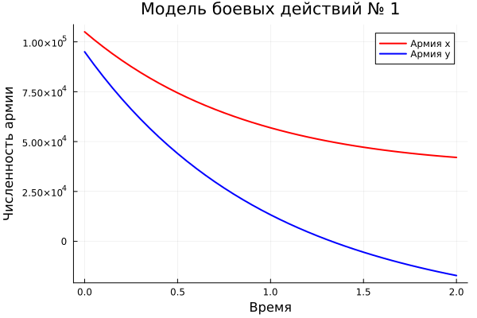

---
## Front matter
title: "Отчет по лабораторной работе №3"
subtitle: "Модель боевых действий"
author: "Легиньких Галина Андреевна"

## Generic otions
lang: ru-RU
toc-title: "Содержание"
## Bibliography
bibliography: bib/cite.bib
csl: pandoc/csl/gost-r-7-0-5-2008-numeric.csl
## Pdf output format
toc: true # Table of contents
toc-depth: 2
lof: true # List of figures
lot: true # List of tables
fontsize: 12pt
linestretch: 1.5
papersize: a4
documentclass: scrreprt
## I18n polyglossia
polyglossia-lang:
  name: russian
  options:
  - spelling=modern
  - babelshorthands=true
polyglossia-otherlangs:
  name: english
## I18n babel
babel-lang: russian
babel-otherlangs: english
## Fonts
mainfont: PT Serif
romanfont: PT Serif
sansfont: PT Sans
monofont: PT Mono
mainfontoptions: Ligatures=TeX
romanfontoptions: Ligatures=TeX
sansfontoptions: Ligatures=TeX,Scale=MatchLowercase
monofontoptions: Scale=MatchLowercase,Scale=0.9
## Biblatex
biblatex: true
biblio-style: "gost-numeric"
biblatexoptions:
  - parentracker=true
  - backend=biber
  - hyperref=auto
  - language=auto
  - autolang=other*
  - citestyle=gost-numeric
## Pandoc-crossref LaTeX customization
figureTitle: "Рис."
tableTitle: "Таблица"
listingTitle: "Листинг"
lofTitle: "Список иллюстраций"
lotTitle: "Список таблиц"
lolTitle: "Листинги"
## Misc options
indent: true
header-includes:
  - \usepackage{indentfirst}
  - \usepackage{float} # keep figures where there are in the text
  - \floatplacement{figure}{H} # keep figures where there are in the text
---

# Цель работы

Рассмотреть некоторые простейшие модели боевых действий – модели Ланчестера. Применить их на практике для решения задания лабораторной работы. 

# Теоретическое введение
Законы Ланчестера представляют собой математические формулы для расчета относительной численности вооруженных сил. Уравнения Ланчестера - это дифференциальные уравнения, описывающие зависимость численности двух армий A и B от времени, причем функция зависит только от A и B.

В 1915 и 1916 годах во время Первой мировой войны М. Осипов и Фредерик Ланчестер независимо разработали серию дифференциальных уравнений, чтобы продемонстрировать соотношение сил между противоборствующими силами. Среди них так называемый линейный закон Ланчестера (для древнего боя) и квадратный закон Ланчестера (для современного боя с применением оружия дальнего действия, такого как огнестрельное оружие). [1]

В противоборстве могут принимать участие как регулярные войска, так и партизанские отряды. В общем случае главной характеристикой соперников являются численности сторон. Если в какой-то момент времени одна из численностей обращается в нуль, то данная сторона считается проигравшей (при условии, что численность другой стороны в данный момент положительна).

Рассмотривается три случая ведения боевых действий:
1. Боевые действия между регулярными войсками
2. Боевые действия с участием регулярных войск и партизанских отрядов
3. Боевые действия между партизанскими отрядами

# Задание
Между страной $Х$ и страной $Y$ идет война. Численность состава войск исчисляется от начала войны, и являются временными функциями $x(t)$ и $y(t)$. В начальный момент времени страна $Х$ имеет армию численностью $105 000$ человек, а в распоряжении страны $Y$ армия численностью в $95 000$ человек. Для упрощения модели считаем, что коэффициенты $a$, $b$, $c$, $h$ постоянны. Также считаем $P(t)$ и $Q(t)$ непрерывными функциями. 

Постройте графики изменения численности войск армии Х и армии У для следующих случаев на языках Julia и OpenModelica:
1. Модель боевых действий между регулярными войсками:

$$ {dx\over {dt}} = -0.35x(t)-0.45y(t)+sin(t)* 2 $$

$$ {dy\over {dt}} = -0.69x(t)-0.61y(t)+cos(t)+1 $$

2. Модель ведение боевых действий с участием регулярных войск и партизанских отрядов:

$$ {dx\over {dt}} = -0.35x(t)-0.73y(t)+2*sin(2t) $$

$$ {dy\over {dt}} = -0.45x(t)y(t)-0.41y(t)+cos(t) + 1 $$

# Выполнение лабораторной работы

## Модель боевых действий между регулярными войсками

Численность регулярных войск определяется тремя факторами:
1. Cкорость уменьшения численности войск из-за причин, не связанных с боевыми действиями (болезни, травмы, дезертирство);
2. Cкорость потерь, обусловленных боевыми действиями противоборствующих сторон (что связанно с качеством стратегии, уровнем вооружения, профессионализмом солдат и т.п.);
3. Cкорость поступления подкрепления (задаётся некоторой функцией от времени).

В этом случае модель боевых действий между регулярными войсками описывается следующим образом:

$$ {dx\over {dt}} = -a(t)x(t)-b(t)y(t)+P(t) $$

$$ {dy\over {dt}} = -c(t)x(t)-h(t)y(t)+Q(t) $$

## Модель ведение боевых действий с участием регулярных войск и партизанских отрядов

Нерегулярные войска в отличии от постоянной армии менее уязвимы, так как действуют скрытно, в этом случае сопернику приходится действовать неизбирательно, по площадям, занимаемым партизанами. Поэтому считается, что тем потерь партизан, проводящих свои операции в разных местах на некоторой известной территории, пропорционален не только численности армейских соединений, но и численности самих партизан. В результате модель принимает вид:

$$ {dx\over {dt}} = -a(t)x(t)-b(t)y(t)+P(t) $$

$$ {dy\over {dt}} = -c(t)x(t)y(t)-h(t)y(t)+Q(t) $$

## Julia [2]
Julia я скачала в прошлой лабораторной работе, поэтому вдаваться в подробности не буду.

Код программы:
```
using DifferentialEquations, Plots

# Начальные условия
x0 = 105000 # численность первой армии
y0 = 95000  # численность второй армии
t0 = 0     # начальный момент времени
tmax = 2   # предельный момент времени
dt = 0.05  # шаг изменения времени
t = t0:dt:tmax
v0 = [x0, y0] # Вектор начальных условий

#--------------------------------------------------------------------------------------

a = 0.35    # константа, характеризующая степень влияния различных факторов на потери
b = 0.45    # эффективность боевых действий армии у
c = 0.69   # эффективность боевых действий армии х
h = 0.61    # константа, характеризующая степень влияния различных факторов на потери

# Возможность подхода подкрепления к армии х
function P(t)
    return sin(t) * 2
end

# Возможность подхода подкрепления к армии у
function Q(t)
    return cos(t) + 1
end

# Система дифференциальных уравнений
function syst(dy, y, p, t)
    dy[1] = -a * y[1] - b * y[2] + P(t) # изменение численности первой армии
    dy[2] = -c * y[1] - h * y[2] + Q(t) # изменение численности второй армии
end

# Решение системы для первой модели
y = solve(ODEProblem(syst, v0, (t0, tmax)), Tsit5(), saveat=t)

# Построение и сохранение графика для первой модели
plot(t, y[1,:], label="Армия x", lw=2, color=:red, xlabel="Время", ylabel="Численность армии")
plot!(t, y[2,:], label="Армия y", lw=2, color=:blue, grid=true)
title!("Модель боевых действий № 1")
savefig("battle_model_1_julia.png")

#---------------------------------------------------------------------------------------------

a_2 = 0.35
b_2 = 0.73
c_2 = 0.45
h_2 = 0.41

# Возможность подхода подкрепления к армии х
function P_2(t)
    return sin(2 * t) * 2
end

# Возможность подхода подкрепления к армии у
function Q_2(t)
    return cos(t) + 1
end

# Система дифференциальных уравнений
function syst_2(dy, y, p, t)
    dy[1] = -a_2 * y[1] - b_2 * y[2] + P_2(t) # изменение численности первой армии
    dy[2] = (-c_2 * y[1] - h_2) * y[2] + Q_2(t) # изменение численности второй армии
end

# Решение системы для второй модели
y_2 = solve(ODEProblem(syst_2, v0, (t0, tmax)), Tsit5(), saveat=t)

# Построение и сохранение графика для второй модели
plot(t, y_2[1,:], label="Армия x", lw=2, color=:red, xlabel="Время", ylabel="Численность армии")
plot!(t, y_2[2,:], label="Армия y", lw=2, color=:blue, grid=true)
title!("Модель боевых действий № 2")
savefig("battle_model_2_julia.png")
```
Скомпилируем файл командной в PShell: (рис. [-@fig:001])

{ #fig:001 width=70% }

Модель боевых действий между регулярными войсками: (рис. [-@fig:002])

{ #fig:002 width=70% }

Модель ведение боевых действий с участием регулярных войск и партизанских отрядов: (рис. [-@fig:003])

{ #fig:003 width=70% }

## OpenModelica  [3]

Установла OpenModelica: (рис. [-@fig:004])

{ #fig:004 width=70% }

Код программы:
```
model lab3
Real x;
Real y;
Real a = 0.35;
Real b = 0.45;
Real c = 0.69;
Real d = 0.61;
Real t = time;
initial equation
x = 105000;
y = 95000;
equation
der(x) = -a*x - b*y + sin(t)*2;
der(y) = -c*x - d*y + cos(t)+1;
end lab3;
```
Модель боевых действий между регулярными войсками: (рис. [-@fig:005])

{ #fig:005 width=70% }


Код программы:
```
model lab3_2
Real x;
Real y;
Real a = 0.35;
Real b = 0.73;
Real c = 0.45;
Real d = 0.41;
Real t = time;
initial equation
x = 105000;
y = 95000;
equation
der(x) = -a*x - b*y + sin(2*t) * 2;
der(y) = -c*x*y - d*y + cos(t) + 1;
end lab3_2;
```
Модель ведение боевых действий с участием регулярных войск и партизанских отрядов: (рис. [-@fig:006])

{ #fig:006 width=70% }


# Анализ полученных результатов. Сравнение языков.
Как видно из графиков, для первой модели, то есть двух регулярных армий, противостоящих друг другу, графики на Julia и OpenModelica идентичны (с поправкой на использование разных графических ресурсов, разный масштаб и т.д.).
Аналогичная ситуация верна и для графиков противостояния регулярной армии армии партизанов, которые рассматривались во второй модели.

# Вывод
По итогам лабораторной работы я построила по две модели на языках Julia и OpenModelica. В ходе проделанной работы можно сделать вывод, что OpenModelica лучше приспособлен для моделирование процессов, протекающих во времени. Построение моделей боевых действий на языке OpenModelica занимает гораздо меньше строк и времени, чем аналогичное построение на языке Julia.

# Список литературы. Библиография
[1] Законы Ланчестера: https://ru.wikipedia.org/wiki/%D0%97%D0%B0%D0%BA%D0%BE%D0%BD%D1%8B_%D0%9E%D1%81%D0%B8%D0%BF%D0%BE%D0%B2%D0%B0_%E2%80%94_%D0%9B%D0%B0%D0%BD%D1%87%D0%B5%D1%81%D1%82%D0%B5%D1%80%D0%B0

[2] Документация по Julia: https://docs.julialang.org/en/v1/

[3] Документация по OpenModelica: https://openmodelica.org/


