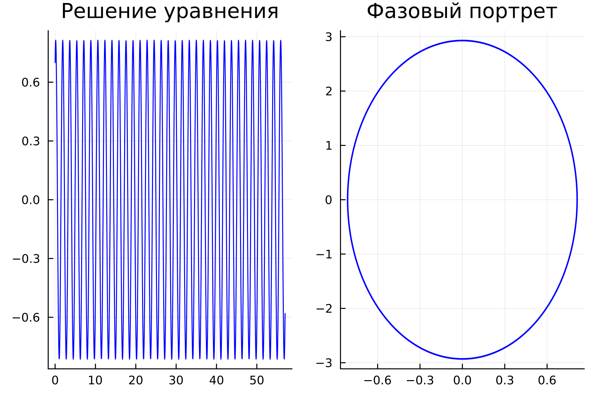
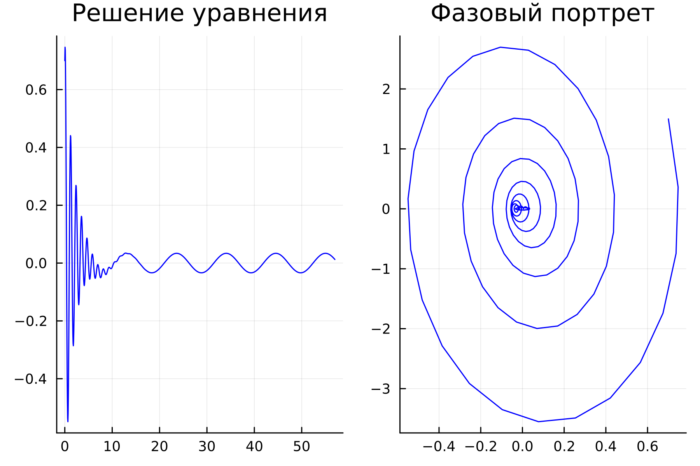
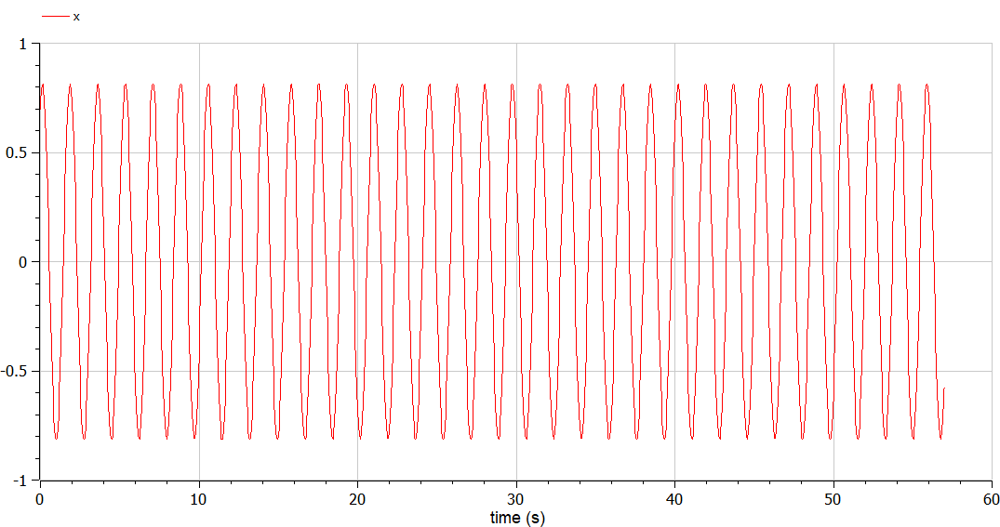
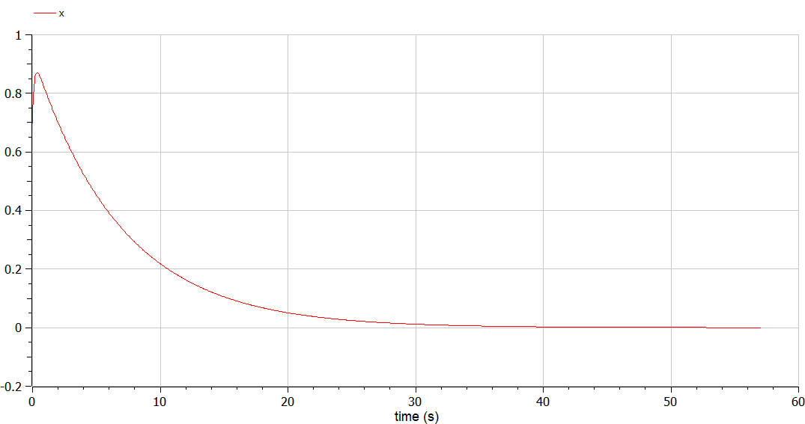
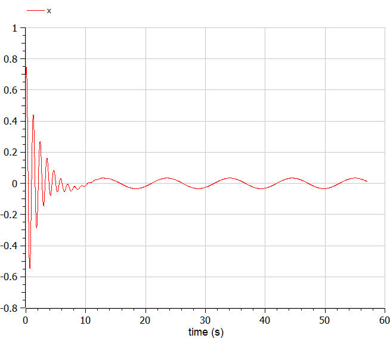
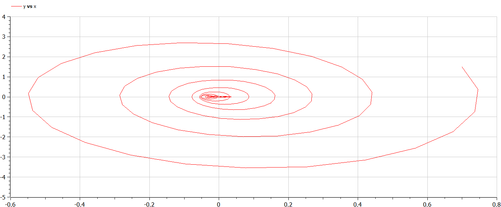

---
## Front matter
lang: ru-RU
title: Лабораторная работа №4
subtitle: Модель гармонических колебаний
author:
  - Легиньких Г.А.
institute:
  - Российский университет дружбы народов, Москва, Россия

## i18n babel
babel-lang: russian
babel-otherlangs: english

## Formatting pdf
toc: false
toc-title: Содержание
slide_level: 2
aspectratio: 169
section-titles: true
theme: metropolis
header-includes:
 - \metroset{progressbar=frametitle,sectionpage=progressbar,numbering=fraction}
 - '\makeatletter'
 - '\beamer@ignorenonframefalse'
 - '\makeatother'
---

# Информация

## Докладчик

:::::::::::::: {.columns align=center}
::: {.column width="70%"}

  * Легиньких Галина Андреевна
  * НФИбд-02-21
  * Российский университет дружбы народов
  * [1032216447@pfur.ru](mailto:1032216447@pfur.ru)
  * <https://github.com/galeginkikh>

:::
::: {.column width="30%"}

:::
::::::::::::::

# Модель гармонических колебаний

## Цель работы

Изучить понятие гармонического осциллятора, построить фазовый портрет и найти решение уравнения гармонического осциллятора.

# Теоретическое введение

**Гармонический осциллятор** — система, которая при выведении её из положения равновесия испытывает действие возвращающей силы $F$, пропорциональной смещению $x$.

**Гармоническое колебание**  - колебания, при которых физическая величина изменяется с течением времени по гармоническому (синусоидальному, косинусоидальному) закону.

## Задание

Мой вариант 18:

Постройте фазовый портрет гармонического осциллятора и решение уравнения гармонического осциллятора для следующих случаев:

1. Колебания гармонического осциллятора без затуханий и без действий внешней силы $\ddot{x}+13x=0$;
2. Колебания гармонического осциллятора c затуханием и без действий внешней силы $\ddot{x}+7\dot{x}+x=0$
3. Колебания гармонического осциллятора c затуханием и под действием внешней силы $\ddot{x}+\dot{x}+30x=sin(0.6t)$

На интервале $t\in [0;57]$ (шаг $0.05$) с начальными условиями $x_0=0.7, y_0=1.5$.

#  Выполнение лабораторной работы

## Julia

(рис. [-@fig:010]) 

{#fig:010 width=50% }

## Колебания гармонического осциллятора c затуханием и без действий внешней силы

(рис. [-@fig:001]) 

{#fig:001 width=60% }

## Колебания гармонического осциллятора c затуханием и без действий внешней силы 

(рис. [-@fig:002]) 

{#fig:002 width=60% }

## Колебания гармонического осциллятора c затуханием и под действием внешней силы 

(рис. [-@fig:003]) 

{#fig:003 width=60% }

## OpenModelica

(рис. [-@fig:011]) 

{#fig:011 width=60% }

## Колебания гармонического осциллятора без затуханий и без действий внешней силы (рис. [-@fig:004]) (рис. [-@fig:005])

{#fig:004 width=60% }

##

{#fig:005 width=60% }

## Колебания гармонического осциллятора c затуханием и без действий внешней силы (рис. [-@fig:006]) (рис. [-@fig:007])

{#fig:006 width=60% }

##

{#fig:07 width=60% }

## Колебания гармонического осциллятора c затуханием и под действием внешней силы (рис. [-@fig:008]) (рис. [-@fig:009])

{#fig:008 width=60% }

##

{#fig:009 width=60% }

## Анализ полученных результатов. Сравнение языков.

В итоге проделанной работы мы построили по три модели (включающих в себя два графика) на языках Julia и OpenModelica. Построение моделей колебания на языке OpenModelica занимает меньше строк, чем аналогичное построение на Julia.

## Вывод

В ходе выполнения лабораторной работы были построены решения уравнения гармонического осциллятора и фазовые портреты гармонических колебаний без затухания, с затуханием и при действии внешней силы на языках Julia и Open Modelica.