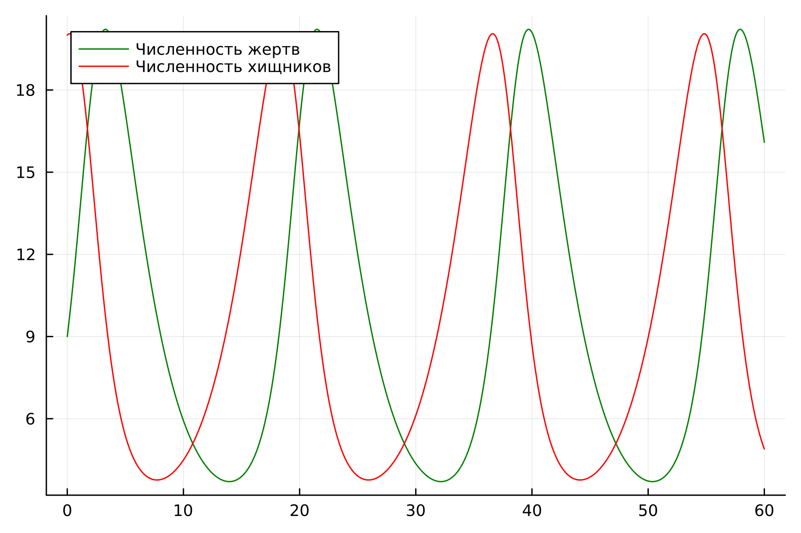
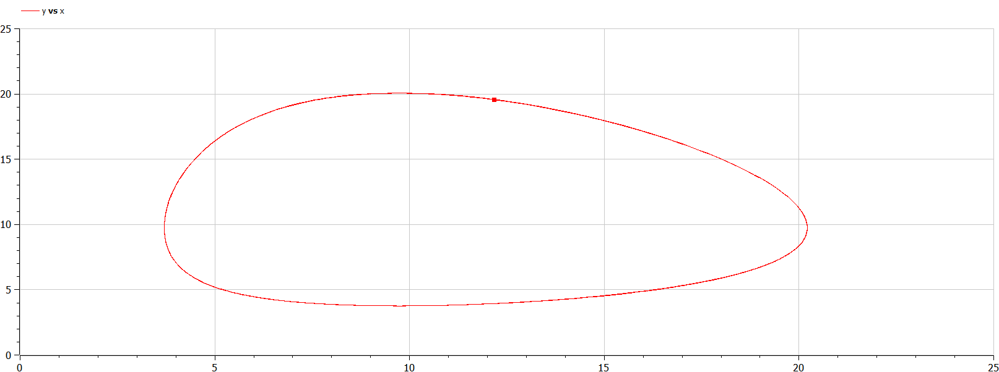
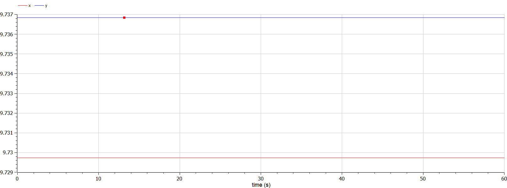

---
## Front matter
lang: ru-RU
title: Лабораторная работа №5
subtitle: Модель хищник-жертва
author:
  - Легиньких Г.А.
institute:
  - Российский университет дружбы народов, Москва, Россия

## i18n babel
babel-lang: russian
babel-otherlangs: english

## Formatting pdf
toc: false
toc-title: Содержание
slide_level: 2
aspectratio: 169
section-titles: true
theme: metropolis
header-includes:
 - \metroset{progressbar=frametitle,sectionpage=progressbar,numbering=fraction}
 - '\makeatletter'
 - '\beamer@ignorenonframefalse'
 - '\makeatother'
---

# Информация

## Докладчик

:::::::::::::: {.columns align=center}
::: {.column width="70%"}

  * Легиньких Галина Андреевна
  * НФИбд-02-21
  * Российский университет дружбы народов
  * [1032216447@pfur.ru](mailto:1032216447@pfur.ru)
  * <https://github.com/galeginkikh>

:::
::: {.column width="30%"}

:::
::::::::::::::

# Модель хищник-жертва

## Цель работы

Изучить модель хищник-жертва и построить эту модель.

# Теоретическое введение

##

Простейшая модель взаимодействия двух видов типа «хищник — жертва» - модель Лотки-Вольтерры.

$$
 \begin{cases}
	\frac{dx}{dt} = (-ax(t) + by(t)x(t))
	\\   
	\frac{dy}{dt} = (cy(t) - dy(t)x(t))
 \end{cases}
$$

##

Математический анализ этой (жёсткой) модели показывает, что имеется стационарное состояние, всякое же другое начальное состояние приводит к периодическому колебанию численности как жертв, так и хищников, так что по прошествии некоторого времени такая система вернётся в изначальное состояние.

# Задание

##

**Мой вариант 18.**

##

Для модели «хищник-жертва»:

$$
 \begin{cases}
	\frac{dx}{dt} = -0.37x(t) + 0.038y(t)x(t)
	\\   
	\frac{dy}{dt} = 0.36y(t) - 0.037y(t)x(t)
 \end{cases}
$$

Постройте график зависимости численности хищников от численности жертв, а также графики изменения численности хищников и численности жертв при следующих начальных условиях: $x_0=9, y_0=20$. Найдите стационарное состояние системы.

# Выполнение лабораторной работы

## Julia 

Код приведен в отчеты и разобран в видео "Выполнение".

## График зависимости численности хищников от численности жертв

{ #fig:001 width=50% }

## График численности жертв и хищников от времени

{ #fig:002 width=50% }

## Стационарное состояние

{ #fig:003 width=50% }

## OpenModelica 

Код приведен в отчеты и разобран в видео "Выполнение".

## График зависимости численности хищников от численности жертв

{ #fig:004 width=50% }

## График численности жертв и хищников от времени

{ #fig:005 width=50% }

## Стационарное состояние

{ #fig:006 width=50% }

# Анализ и вывод

## Анализ полученных результатов. Сравнение языков.

В итоге проделанной работы мы построили график зависимости численности хищников от численности жертв, а также графики изменения численности хищников и численности жертв на языках Julia и OpenModelica. Построение модели хищник-жертва на языке openModelica занимает меньше строк, чем аналогичное построение на Julia.

##  Вывод

В ходе выполнения лабораторной работы была изучена модель хищник-жертва и построена модель на языках Julia и Open Modelica.

# Библиография

##

[1] Документация по Julia: https://docs.julialang.org/en/v1/

[2] Документация по OpenModelica: https://openmodelica.org/

[3] Модель Лотки—Вольтерры: https://math-it.petrsu.ru/users/semenova/MathECO/Lections/Lotka_Volterra.pdf

