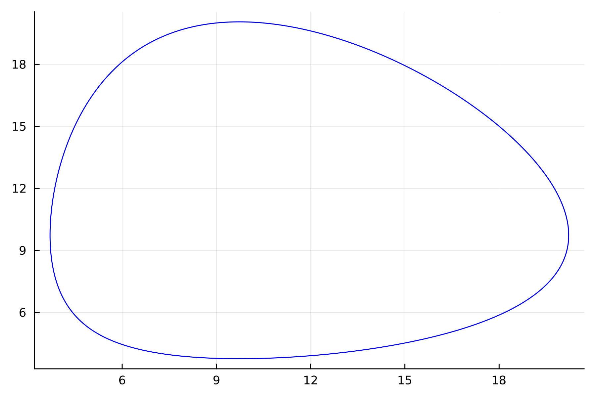
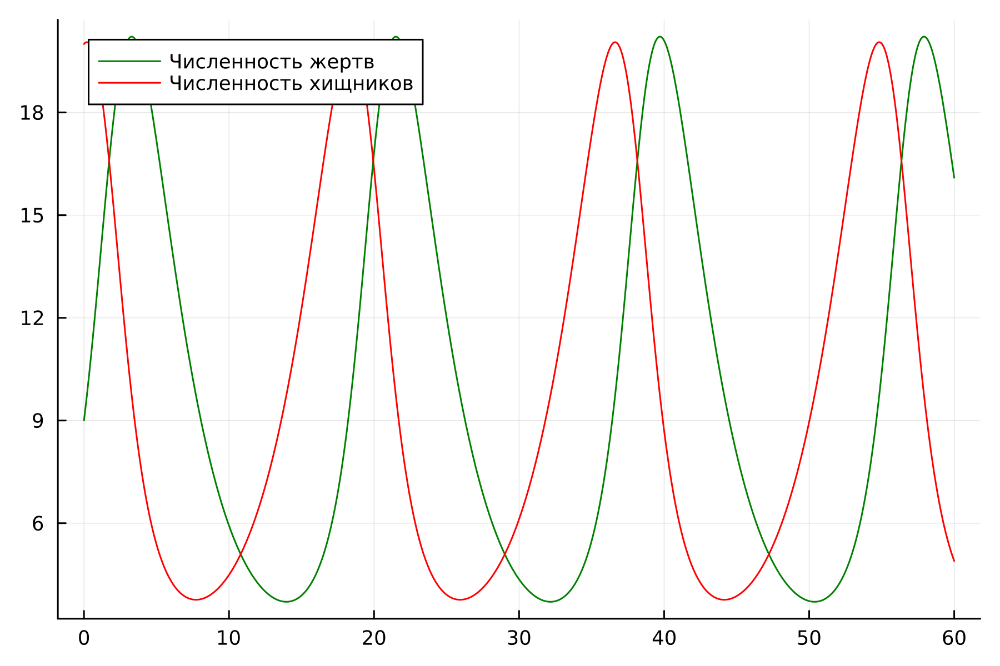
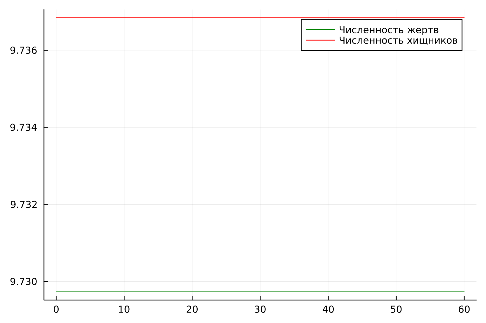
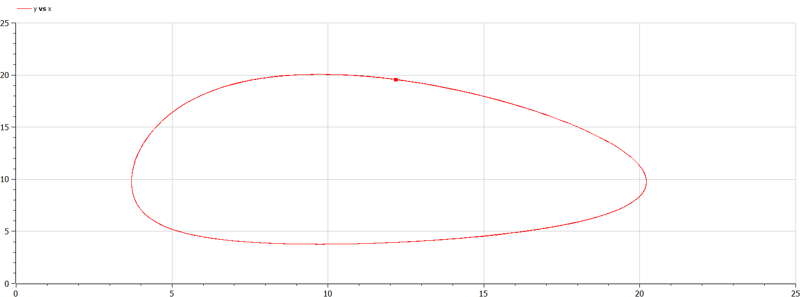
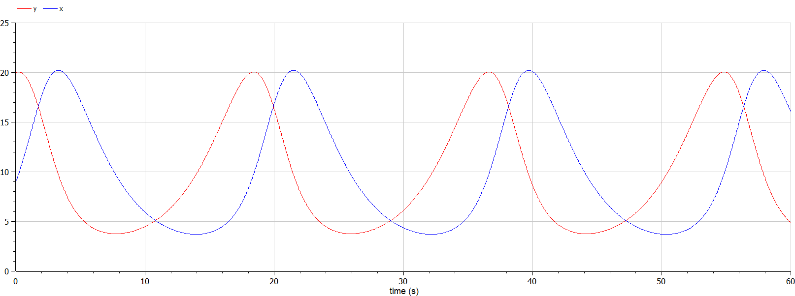
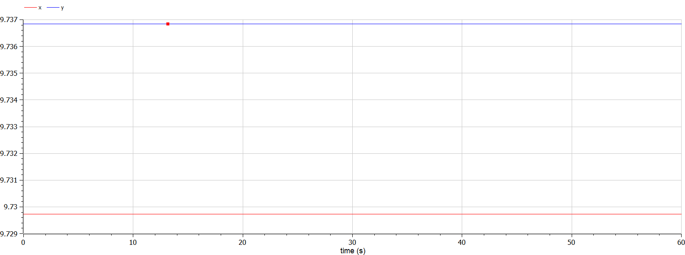

---
## Front matter
title: "Отчет по лабораторной работе №5"
subtitle: "Модель хищник-жертва"
author: "Легиньких Галина Андреевна"

## Generic otions
lang: ru-RU
toc-title: "Содержание"
## Bibliography
bibliography: bib/cite.bib
csl: pandoc/csl/gost-r-7-0-5-2008-numeric.csl
## Pdf output format
toc: true # Table of contents
toc-depth: 2
lof: true # List of figures
lot: true # List of tables
fontsize: 12pt
linestretch: 1.5
papersize: a4
documentclass: scrreprt
## I18n polyglossia
polyglossia-lang:
  name: russian
  options:
  - spelling=modern
  - babelshorthands=true
polyglossia-otherlangs:
  name: english
## I18n babel
babel-lang: russian
babel-otherlangs: english
## Fonts
mainfont: PT Serif
romanfont: PT Serif
sansfont: PT Sans
monofont: PT Mono
mainfontoptions: Ligatures=TeX
romanfontoptions: Ligatures=TeX
sansfontoptions: Ligatures=TeX,Scale=MatchLowercase
monofontoptions: Scale=MatchLowercase,Scale=0.9
## Biblatex
biblatex: true
biblio-style: "gost-numeric"
biblatexoptions:
  - parentracker=true
  - backend=biber
  - hyperref=auto
  - language=auto
  - autolang=other*
  - citestyle=gost-numeric
## Pandoc-crossref LaTeX customization
figureTitle: "Рис."
tableTitle: "Таблица"
listingTitle: "Листинг"
lofTitle: "Список иллюстраций"
lotTitle: "Список таблиц"
lolTitle: "Листинги"
## Misc options
indent: true
header-includes:
  - \usepackage{indentfirst}
  - \usepackage{float} # keep figures where there are in the text
  - \floatplacement{figure}{H} # keep figures where there are in the text
---

# Цель работы
Изучить модель хищник-жертва и построить эту модель.

# Теоретическое введение
Простейшая модель взаимодействия двух видов типа «хищник — жертва» - модель Лотки-Вольтерры. Данная двувидовая модель основывается на следующих предположениях: [3]

1. Численность популяции жертв x и хищников y зависят только от времени (модель не учитывает пространственное распределение популяции на занимаемой территории)

2. В отсутствии взаимодействия численность видов изменяется по модели Мальтуса, при этом число жертв увеличивается, а число хищников падает

3. Естественная смертность жертвы и естественная рождаемость хищника считаются несущественными

4. Эффект насыщения численности обеих популяций не учитывается

5. Скорость роста численности жертв уменьшается пропорционально численности хищников

$$
 \begin{cases}
	\frac{dx}{dt} = (-ax(t) + by(t)x(t))
	\\   
	\frac{dy}{dt} = (cy(t) - dy(t)x(t))
 \end{cases}
$$

В этой модели $x$ – число жертв, $y$ - число хищников. Коэффициент $a$ описывает скорость естественного прироста числа жертв в отсутствие хищников, $с$ - естественное вымирание хищников, лишенных пищи в виде жертв. Вероятность взаимодействия жертвы и хищника считается пропорциональной как количеству жертв, так и числу самих хищников ($xy$). Каждый акт взаимодействия уменьшает популяцию жертв, но способствует увеличению популяции хищников (члены $-bxy$ и $dxy$ в правой части уравнения).

Математический анализ этой (жёсткой) модели показывает, что имеется стационарное состояние, всякое же другое начальное состояние приводит к периодическому колебанию численности как жертв, так и хищников, так что по прошествии некоторого времени такая система вернётся в изначальное состояние.

Стационарное состояние системы (положение равновесия, не зависящее от времени решения) будет находиться в точке $x_0=\frac{c}{d}, y_0=\frac{a}{b}$. Если начальные значения задать в стационарном состоянии $x(0) = x_0, y(0) = y_0$, то в любой момент времени численность популяций изменяться не будет. При малом отклонении от положения равновесия численности как хищника, так и жертвы с течением времени не возвращаются к равновесным значениям, а совершают периодические колебания вокруг стационарной точки. Амплитуда колебаний и их период определяется начальными значениями численностей $x(0), y(0)$. Колебания совершаются в противофазе.

# Задание

**Мой вариант 18.**

Для модели «хищник-жертва»:

$$
 \begin{cases}
	\frac{dx}{dt} = -0.37x(t) + 0.038y(t)x(t)
	\\   
	\frac{dy}{dt} = 0.36y(t) - 0.037y(t)x(t)
 \end{cases}
$$

Постройте график зависимости численности хищников от численности жертв, а также графики изменения численности хищников и численности жертв при следующих начальных условиях: $x_0=9, y_0=20$. Найдите стационарное состояние системы.

# Выполнение лабораторной работы

## Julia 

Нестационарное состояние (рис. [-@fig:001]) (рис. [-@fig:002]):

```
using Plots
using DifferentialEquations

x0 = 9
y0 = 20
a = 0.37
b = 0.038
c = 0.36
d = 0.037

function ode_fn(du, u, p, t)
    x, y = u
    du[1] = -a*u[1] + b * u[1] * u[2]
    du[2] = c * u[2] - d * u[1] * u[2]
end

v0 = [x0, y0]
tspan = (0.0, 60.0)
prob = ODEProblem(ode_fn, v0, tspan)
sol = solve(prob, dtmax=0.05)
X = [u[1] for u in sol.u]
Y = [u[2] for u in sol.u]
T = [t for t in sol.t]

plt = plot(dpi=300, legend=false)
plot!(plt, X, Y, label="Зависимость численности хищников от численности жертв", color=:blue)
savefig(plt, "model_1.png")


plt2 = plot(dpi=300, legend=true)
plot!(plt2, T, X, label="Численность жертв", color=:green)
plot!(plt2, T, Y, label="Численность хищников", color=:red)
savefig(plt2, "model_2.png")
```

{ #fig:001 width=70% }

{ #fig:002 width=70% }

Стационарное состояние (рис. [-@fig:003]):

```
using Plots
using DifferentialEquations

a = 0.37
b = 0.038
c = 0.36
d = 0.037
x0 = c / d 
y0 = a / b

function ode_fn(du, u, p, t)
    x, y = u
    du[1] = -a*u[1] + b * u[1] * u[2]
    du[2] = c * u[2] - d * u[1] * u[2]
end

v0 = [x0, y0]
tspan = (0.0, 60.0)
prob = ODEProblem(ode_fn, v0, tspan)
sol = solve(prob, dtmax=0.05)
X = [u[1] for u in sol.u]
Y = [u[2] for u in sol.u]
T = [t for t in sol.t]

plt = plot(dpi=300, legend=true)
plot!(plt, T, X, label="Численность жертв", color=:green)
plot!(plt, T, Y, label="Численность хищников", color=:red)
savefig(plt, "model_3.png")
```

В стационарном состоянии решение вида $y(x)=some function$ будет представлять собой точку.

{ #fig:003 width=70% }


## OpenModelica 

Нестационарное состояние (рис. [-@fig:004]) (рис. [-@fig:005]):

```
model lab5
Real a = 0.37;
Real b = 0.038;
Real c = 0.36;
Real d = 0.037;
Real x;
Real y;
initial equation
x = 9;
y = 20;
equation
der(x) = -a*x + b*x*y;
der(y) = c*y - d*x*y;
end lab5;
```

{ #fig:004 width=70% }

{ #fig:005 width=70% }


Cтационарное состояние (рис. [-@fig:006]):

```
model lab5_2
Real a = 0.37;
Real b = 0.038;
Real c = 0.36;
Real d = 0.037;
Real x;
Real y;
initial equation
x = c / d;
y = a / b;
equation
der(x) = -a*x + b*x*y;
der(y) = c*y - d*x*y;
end lab5_2;
```

В стационарном состоянии решение вида $y(x)=some function$ будет представлять собой точку.

{ #fig:006 width=70% }

# Анализ полученных результатов. Сравнение языков.

В итоге проделанной работы мы построили график зависимости численности хищников от численности жертв, а также графики изменения численности хищников и численности жертв на языках Julia и OpenModelica. Построение модели хищник-жертва на языке openModelica занимает меньше строк, чем аналогичное построение на Julia.

# Вывод

В ходе выполнения лабораторной работы была изучена модель хищник-жертва и построена модель на языках Julia и Open Modelica.

# Список литературы. Библиография

[1] Документация по Julia: https://docs.julialang.org/en/v1/

[2] Документация по OpenModelica: https://openmodelica.org/

[3] Модель Лотки—Вольтерры: https://math-it.petrsu.ru/users/semenova/MathECO/Lections/Lotka_Volterra.pdf
