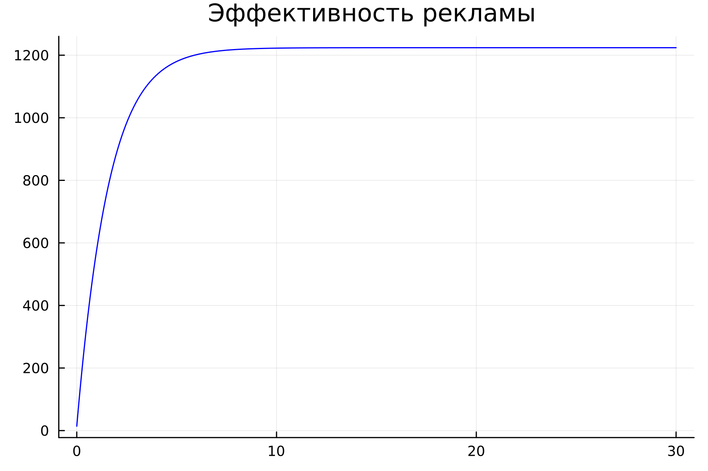

---
## Front matter
lang: ru-RU
title: Лабораторная работа №7
subtitle: Модель эффективности рекламы
author:
  - Легиньких Г.А.
institute:
  - Российский университет дружбы народов, Москва, Россия

## i18n babel
babel-lang: russian
babel-otherlangs: english

## Formatting pdf
toc: false
toc-title: Содержание
slide_level: 2
aspectratio: 169
section-titles: true
theme: metropolis
header-includes:
 - \metroset{progressbar=frametitle,sectionpage=progressbar,numbering=fraction}
 - '\makeatletter'
 - '\beamer@ignorenonframefalse'
 - '\makeatother'
---

# Информация

## Докладчик

:::::::::::::: {.columns align=center}
::: {.column width="70%"}

  * Легиньких Галина Андреевна
  * НФИбд-02-21
  * Российский университет дружбы народов
  * [1032216447@pfur.ru](mailto:1032216447@pfur.ru)
  * <https://github.com/galeginkikh>

:::
::: {.column width="30%"}

:::
::::::::::::::

# Модель эффективности рекламы

## Цель работы

Изучить и построить модель эффективности рекламы.

# Теоретическое введение

##

Организуется рекламная кампания нового товара или услуги. Необходимо, чтобы прибыль будущих продаж с избытком покрывала издержки на рекламу. Вначале расходы могут превышать прибыль, поскольку лишь малая часть потенциальных покупателей будет информирована о новинке. Затем, при увеличении числа продаж, возрастает и прибыль, и, наконец, наступит момент, когда рынок насытиться, и рекламировать товар станет бесполезным.

##

Предположим, что торговыми учреждениями реализуется некоторая продукция, о которой в момент времени $t$ из числа потенциальных покупателей $N$ знает лишь $n$ покупателей. Для ускорения сбыта продукции запускается реклама по радио, телевидению и других средств массовой информации. После запуска рекламной кампании информация о продукции начнет распространяться среди потенциальных покупателей путем общения друг с другом. Таким образом, после запуска рекламных объявлений скорость изменения числа знающих о продукции людей пропорциональна как числу знающих о товаре покупателей, так и числу покупателей о нем не знающих

##

Математическая модель распространения рекламы описывается уравнением:

$$\frac{dn}{dt} = (\alpha _1(t) + \alpha _2(t)n(t))(N-n(t))$$

##

При $\alpha _1(t) >> \alpha _2(t)$ получается модель типа модели Мальтуса, решение которой имеет вид: 

{ #fig:001 width=30% }

##

В обратном случае $\alpha _1(t) << \alpha _2(t)$ получаем уравнение логистической кривой:

{ #fig:002 width=30% }

# Задание

##

**Мой вариант 18**

##

Постройте график распространения рекламы, математическая модель которой описывается следующим уравнением:

1.	$\frac{dn}{dt} = (0.61 + 0.000061n(t))(N-n(t))$
2.	$\frac{dn}{dt} = (0.000073 + 0.73n(t))(N-n(t))$
3.	$\frac{dn}{dt} = (0.7t + 0.6\cos{(t)} n(t))(N-n(t))$

При этом объем аудитории $N = 1224$, в начальный момент о товаре знает 14 человек. Для случая 2 определите в какой момент времени скорость распространения рекламы будет иметь максимальное значение.

# Выполнение лабораторной работы

## Julia

Код приведен в отчете и разобран в видео "Выполнение".

## Первый случай

{ #fig:003 width=30% }

## Второй случай

{ #fig:004 width=30% }

## Третий случай

{ #fig:005 width=30% }

## OpenModelica 

Код приведен в отчете и разобран в видео "Выполнение".

## Первый случай

{ #fig:006 width=30% }

## Второй случай

{ #fig:007 width=30% }

## Третий случай

{ #fig:008 width=30% }

# Анализ и вывод

## Анализ полученных результатов. Сравнение языков.

В итоге проделанной работы мы построили графики распространения рекламы для трех случаев на языках Julia и OpenModelica. Построение модели распространения рекламы на языке OpenModelica занимает значительно меньше строк, чем аналогичное построение на Julia. 
Кроме того, построения на языке OpenModelica проводятся относительно значения времени t по умолчанию, что упрощает нашу работу. 

## Вывод

В ходе выполнения лабораторной работы была изучена модель эффективности рекламы и в дальнейшем построена модель на языках Julia и Open Modelica.

# Список литературы. Библиография.

##

[1] Документация по Julia: https://docs.julialang.org/en/v1/

[2] Документация по OpenModelica: https://openmodelica.org/

[3] Мальтузианская модель роста: https://www.stolaf.edu//people/mckelvey/envision.dir/malthus.html

