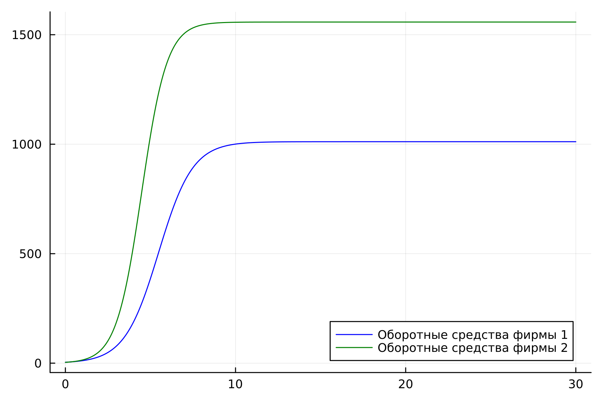
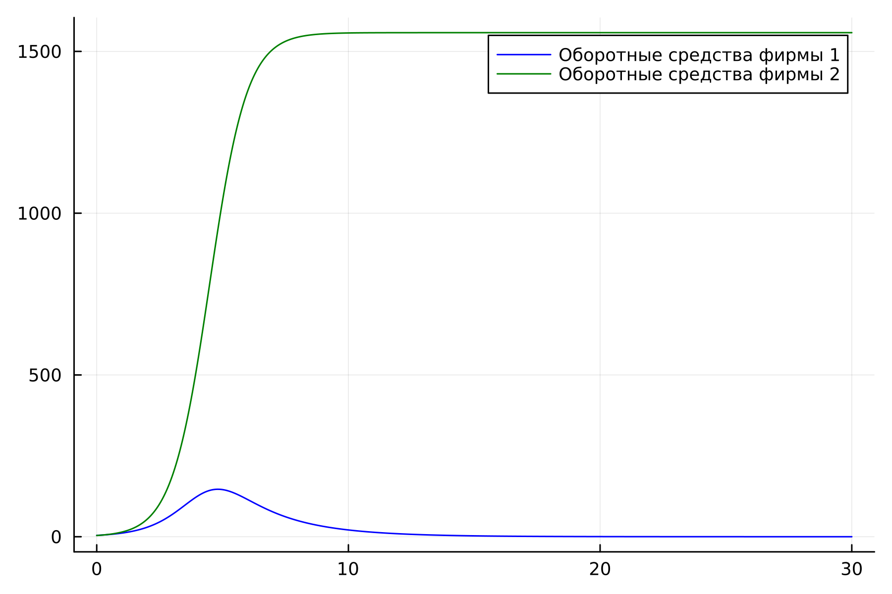
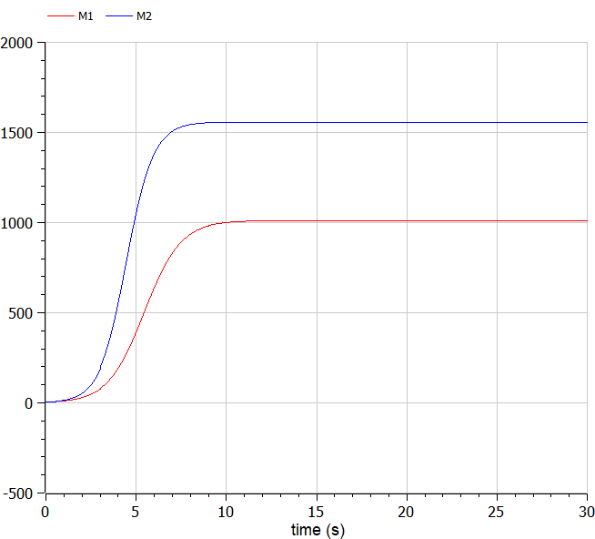
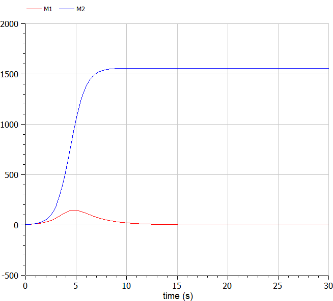

---
## Front matter
lang: ru-RU
title: Лабораторная работа №8
subtitle: Модель конкуренции двух фирм
author:
  - Легиньких Г.А.
institute:
  - Российский университет дружбы народов, Москва, Россия

## i18n babel
babel-lang: russian
babel-otherlangs: english

## Formatting pdf
toc: false
toc-title: Содержание
slide_level: 2
aspectratio: 169
section-titles: true
theme: metropolis
header-includes:
 - \metroset{progressbar=frametitle,sectionpage=progressbar,numbering=fraction}
 - '\makeatletter'
 - '\beamer@ignorenonframefalse'
 - '\makeatother'
---

# Информация

## Докладчик

:::::::::::::: {.columns align=center}
::: {.column width="70%"}

  * Легиньких Галина Андреевна
  * НФИбд-02-21
  * Российский университет дружбы народов
  * [1032216447@pfur.ru](mailto:1032216447@pfur.ru)
  * <https://github.com/galeginkikh>

:::
::: {.column width="30%"}

:::
::::::::::::::

# Модель конкуренции двух фирм

## Цель работы

Изучить и построить модель конкуренции двух фирм.

# Теоретическое введение. 

## 

Для построения модели конкуренции хотя бы двух фирм необходимо рассмотреть модель одной фирмы. Вначале рассмотрим модель фирмы, производящей продукт долговременного пользования, когда цена его определяется балансом спроса и предложения. Примем, что этот продукт занимает определенную нишу рынка и конкуренты в ней отсутствуют. 

##

$N$ - число потребителей производимого продукта. 

$S$ – доходы потребителей данного продукта. Считаем, что доходы всех потребителей одинаковы. Это предположение справедливо, если речь идет об одной рыночной нише, т.е. производимый продукт ориентирован на определенный слой населения. 

$M$ – оборотные средства предприятия 

$\tau$ - длительность производственного цикла

$p$ - рыночная цена товара 

$\widetilde{p}$ - себестоимость продукта, то есть переменные издержки на производство единицы продукции

$\delta$ - доля оборотных средств, идущая на покрытие переменных издержек

$k$ - постоянные издержки, которые не зависят от количества выпускаемой продукции

# Задание

##

**Мой вариант 18**

## Случай 1

##

Рассмотрим две фирмы, производящие взаимозаменяемые товары одинакового качества и находящиеся в одной рыночной нише. Считаем, что в рамках нашей модели конкурентная борьба ведётся только рыночными методами. То есть, конкуренты могут влиять на противника путем изменения параметров своего производства: себестоимость, время цикла, но не могут прямо вмешиваться в ситуацию на рынке («назначать» цену или влиять на потребителей каким-либо иным способом.) Будем считать, что постоянные издержки пренебрежимо малы, и в модели учитывать не будем. В этом случае динамика изменения объемов продаж фирмы 1 и фирмы 2 описывается следующей системой уравнений:

##

$$\frac{dM_1}{d\Theta} = M_1 - \frac{b}{c_1}M_1 M_2 - \frac{a1}{c1} M_1^2 $$

$$\frac{dM_2}{d\Theta} = \frac{c_2}{c_1}M_2 - \frac{b}{c_1} M_1 M_2 - \frac{a_2}{c_1} M_2^2$$
где 

##

$$a_1 = \frac{p_{cr}}{\tau_1^2 \widetilde{p}_1^2 Nq }$$

$$a_2 = \frac{p_{cr}}{\tau_2^2 \widetilde{p}_2^2 Nq }$$ 

$$b = \frac{p_{cr}}{\tau_1^2 \widetilde{p}_1^2 \tau_2^2 \widetilde{p}_2^2 Nq}$$

$$c_1 = \frac{p_{cr} - \widetilde{p}_1}{\tau_1 \widetilde{p}_1}$$

$$c_2 = \frac{p_{cr} - \widetilde{p}_2}{\tau_2 \widetilde{p}_2}$$

также введена нормировка $t = c_1 \Theta$

## Случай 2

##

Рассмотрим модель, когда, помимо экономического фактора влияния (изменение себестоимости, производственного цикла, использование кредита и т.п.), используются еще и социально-психологические факторы – формирование общественного предпочтения одного товара другому, не зависимо от их качества и цены. В этом случае взаимодействие двух фирм будет зависеть друг от друга, соответственно коэффициент перед $M_1 M_2$ будет отличаться. Пусть в рамках рассматриваемой модели динамика изменения объемов продаж фирмы 1 и фирмы 2 описывается следующей системой уравнений:

## 

$$\frac{dM_1}{d\Theta} = M_1 - (\frac{b}{c_1} + 0.0009)M_1 M_2 - \frac{a1}{c1} M_1^2 $$

$$ \frac{dM_2}{d\Theta} = \frac{c_2}{c_1} M_2 - \frac{b}{c_1} M_1 M_2 - \frac{a_2}{c_1} M_2^2$$

##

Для обоих случаев рассмотрим задачу со следующими начальными условиями и параметрами

$$ M_0^1=4.2 \: M_0^2=3.8 $$
$$ p_{cr}=11.4 \: N=26 \: q=1 $$
$$ \tau_1=14 \: \tau_2=22 $$
$$ \widetilde{p}_1=6.6 \: \widetilde{p}_2=4.5 $$

1. Постройте графики изменения оборотных средств фирмы 1 и фирмы 2 без учета постоянных издержек и с веденной нормировкой для случая 1. 
2. Постройте графики изменения оборотных средств фирмы 1 и фирмы 2 без учета постоянных издержек и с веденной нормировкой для случая 2.

# Выполнение лабораторной работы

## Julia

Код программы для двух случаев приведен в отчете и разобран в видео "Выполнение".

## Первый случай

{ #fig:001 width=30% }

## Второй случай

{ #fig:002 width=30% }

## OpenModelica

Код программы для двух случаев приведен в отчете и разобран в видео "Выполнение".

## Первый случай

{ #fig:003 width=30% }

## Второй случай

{ #fig:004 width=30% }

# Анализ и вывод

## Анализ полученных результатов. Сравнение языков.

В итоге проделанной работы на языках Julia и OpenModelica мы построили графики изменения оборотных средств для двух фирм для случаев, когда конкурентная борьба ведётся только рыночными методами и когда, помимо экономического фактора влияния, используются еще и социально-психологические факторы. 

Построение модели конкуренции двух фирм на языке OpenModelica занимает значительно меньше строк кода, чем аналогичное построение на Julia.

## Вывод

В ходе выполнения лабораторной работы была изучена модель конкуренции двух фирм и в дальнейшем построена модель на языках Julia и Open Modelica.

# Список литературы. Библиография.

##

[1] Документация по Julia: https://docs.julialang.org/en/v1/

[2] Документация по OpenModelica: https://openmodelica.org/

[3] Математические модели конкурентной среды: https://dspace.spbu.ru/bitstream/11701/12019/1/Gorynya_2018.pdf

